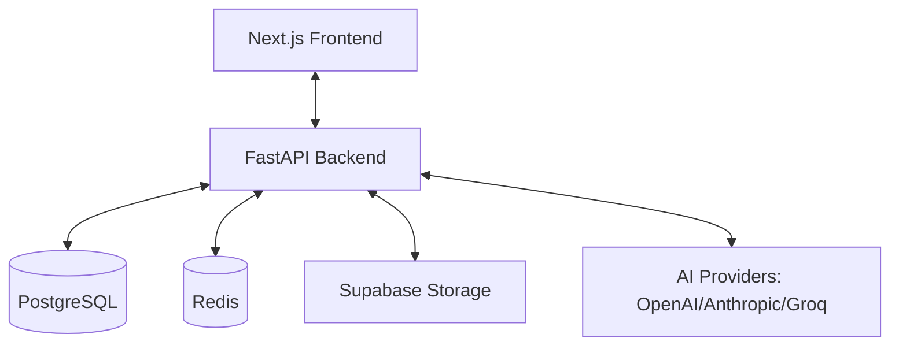

# CALRIMS - AI-Powered Recruitment Information Management System

An industry-leading, fully automated recruitment platform that leverages cutting-edge AI to streamline hiring. From intelligent interviews and resume parsing to data-driven decision making, CALRIMS delivers a **premium, high-performance experience** for both HR teams and candidates.

## 🚀 Key Modern Enhancements

- **Next.js 16 + Tailwind CSS 4**: Built on the absolute latest frontend stack for unmatched performance and developer experience.
- **Unified Global Navigation**: A responsive `GlobalNavbar` providing seamless transitions across landing, authentication, and dashboard views.
- **AI-Driven Logic**: Integrated support for OpenAI, Anthropic, and Groq to provide flexible, intelligent assessments.
- **Premium Aesthetics**: Sophisticated dark/light mode theming with glassmorphism (`backdrop-blur-xl`) and meticulous component design.
- **Real-Time Interaction**: WebSocket-powered live interview engine for synchronous assessment and feedback.

## 🛠️ Project Architecture

CALRIMS is built as a robust, scalable microservices-ready application:

1.  **Frontend**: Next.js 16 (App Router) with TypeScript, Tailwind CSS, and Framer Motion.
2.  **Backend**: High-performance FastAPI (Python 3.12+) with asynchronous handlers.
3.  **Database**: PostgreSQL with SQLAlchemy 2.0 ORM and Alembic migrations.
4.  **Storage**: Supabase Object Storage for resumes and media assets.
5.  **Infrastructure**: Dockerized environment with Nginx and Redis for caching/rate-limiting.

### System Overview



## 📁 Directory Structure

```
├── backend/                  # Python FastAPI backend
│   ├── app/                  # Core application logic (Routes, Services, Models)
│   ├── tests/                # Comprehensive test suite
│   ├── scripts/              # Migration and maintenance scripts
│   ├── Dockerfile            # Containerization settings
│   └── requirements.txt      # Python dependencies
├── frontend/                 # Next.js 16 frontend
│   ├── app/                  # Next.js App Router (Auth, Dashboards, Landing)
│   ├── components/           # Reusable UI components (Shadcn UI based)
│   ├── lib/                  # Shared utilities, hooks, and context
│   ├── tests/                # Playwright & Vitest suites
│   └── package.json          # Node.js dependencies
├── database/                 # Database schema and migration files
├── docs/                     # Extended documentation and guides
├── supabase/                 # Supabase configuration and edge functions
├── docker-compose.prod.yml   # Production deployment orchestration
└── README.md                 # Project documentation
```

## ✨ Core Features

- **AI Interview Engine**: Adaptive voice/text interviews that analyze candidate responses in real-time.
- **Smart Resume Screening**: Automated skill extraction and matching against job requirements using LLMs.
- **Advanced HR Analytics**: Data-driven insights into hiring pipelines, diversity, and time-to-hire.
- **Integrated Support System**: Ticket management for both candidates and HR personnel.
- **Onboarding Pipeline**: Automated workflows to transition candidates from 'Hired' to 'Onboarded'.
- **Role-Based Access Control (RBAC)**: Fine-grained permissions for Candidates, HR Managers, and Super Admins.

## 🚦 Quick Start

### 1. Prerequisites
- **Node.js**: 18.x or higher
- **Python**: 3.9 - 3.12
- **PostgreSQL**: 14+
- **Redis**: 6+ (Optional for local dev)

### 2. Backend Setup
```bash
cd backend
python -m venv venv
# Windows: venv\Scripts\activate | Unix: source venv/bin/activate
pip install -r requirements.txt
cp .env.example .env
# Configure your DATABASE_URL and API keys in .env
python -m uvicorn app.main:app --reload --port 10000
```
*API Docs: [http://localhost:10000/docs](http://localhost:10000/docs)*

### 3. Frontend Setup
```bash
cd frontend
npm install
npm run dev
```
*App URL: [http://localhost:3000](http://localhost:3000)*

### 4. Default Credentials
| Role | Email | Password |
| :--- | :--- | :--- |
| **HR Manager** | `hr@company.com` | `password123` |
| **Candidate** | `candidate@example.com` | `password123` |

## 📚 Documentation & Guides

For more detailed information, please refer to the following guides:
- [Onboarding Guide](file:///c:/Users/aashi/OneDrive/Desktop/Project/rims/ONBOARDING_GUIDE.md) - Detailed setup for new developers.
- [Client Setup Guide](file:///c:/Users/aashi/OneDrive/Desktop/Project/rims/CLIENT_SETUP_GUIDE.md) - Instructions for client deployments.
- [Project Report](file:///c:/Users/aashi/OneDrive/Desktop/Project/rims/PROJECT_REPORT.md) - Technical overview and implementation details.
- [Database Schema](file:///c:/Users/aashi/OneDrive/Desktop/Project/rims/DATABASE_SCHEMA.sql) - Visual representation of the relational model.

---

**Built with ❤️ for Modern Hiring Teams.**
